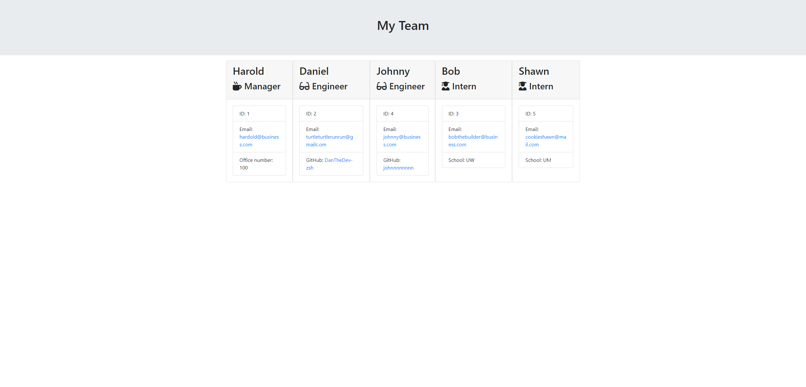
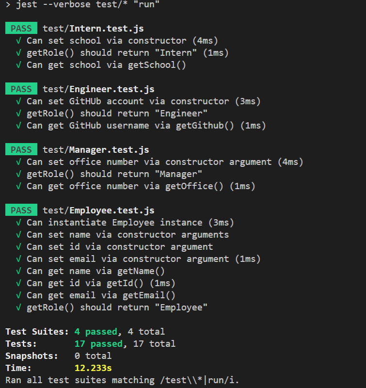

# Team-Profile-Generator

### Description
This program uses prompts to allow user create a professional Team Viewer html file. The HTML file can display as many Engineer and Intern Employees under one single Manager.

### Installation
The installation process requires you to have nodejs and npm installed

### Usage
cd Develop > npm install > node index.js > follow the prompts to create the HTML team viewer.

### Contributing
Feel free to contact me and fork this repository. Contact informations are below this section.

### Tests
To test the classes, use npm test run to validate each class's functionity.

### Video Demonstrations
[Code demonstration](https://drive.google.com/file/d/1BGEvZn9RStu9CXb8b8HRHEzlwkok50oq/view?usp=sharing)   
[Jest testing](https://drive.google.com/file/d/1NTYx1N7rIpuCdR97uQZJ2xZL4TZ-7Y_v/view?usp=sharing)   

### Images 

